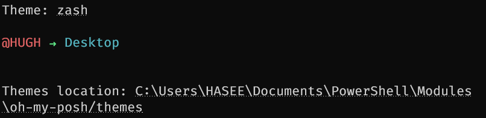

# Posh-Prompt

[English Version is here](README_en.md)

根据 **slimfat** 和 **bubbleline** 两个主题更改出来的新主题

- [x] update the method to use
- [x] en version
- [x] zh_CN version


所需的几样东西

-   Windows Terminal
-   PowerShell7
-   一个支持内容多一点的字体
    -   比如 [FiraCode Nerd Font](https://github.com/ryanoasis/nerd-fonts/releases/download/v2.1.0/FiraCode.zip) ~~点击即下载~~
    -   以及一些其他选择<https://www.nerdfonts.com/font-downloads>
    -   解压后全选安装
    -   在 Windows Terminal 设置中更改字体~~不然有些特殊字符可能乱码/不显示~~
-   可用的网络

## 速览指导

[一份不错的参考](https://zhuanlan.zhihu.com/p/137595941)

>   不过可以跳过**第五点**和**第六点~~（因为现在自动完成了）~~**

### 打开 PowerShell

作为管理员打开（如果你只想安装给当前用户的话 那就不用了

>   下载过程中 可能有一些需要同意的提示 按 **y** 然后回车就好

安装 **PSReadLine** 的指令 用来获得更好的输入体验

```powershell
Install-Module -Name PSReadLine -Scope AllUsers -Force -SkipPublisherCheck
```

安装 [oh-my-posh](https://ohmyposh.dev/)

```powershell
Install-Module oh-my-posh -Scope AllUsers
```

### 添加设置

在 PowerShell 中编辑 `$profile`

```powershell
notepad $profile
```

使用任何你喜欢的编辑器都行

```powershell
#-------------------------------  Set Profile BEGIN    -------------------------
Import-Module oh-my-posh
# Set-PoshPrompt -Theme slimfat
Set-PoshPrompt -Theme schema
# -Theme 后面的参数表示主题名
#-------------------------------  Set Profile END    -------------------------
```


### 添加新主题

查看现有主题

```powershell
Get-PoshThemes
```

主题显示完之后 你会看见主题的保存路径 一般是 `Documents/PowerShell/Modules/oh-my-posh/themes`



<center>结果如图</center>

修改一个现有的主题或者新建一个主题文件都可以

文件的默认后缀是 `.omp.json`

下载这里的 `schema.json` 到主题文件夹 重开终端就行

### 权限报错

如果没有执行 `ps1` 脚本的权限

```powershell
set-ExecutionPolicy RemoteSigned
```

PowerShell输入上述命令